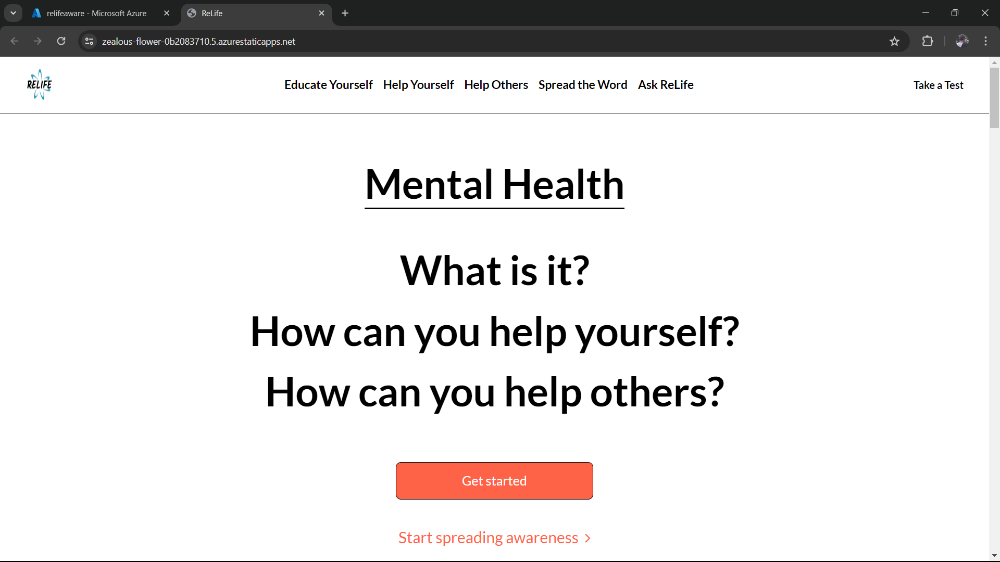

# ReLife

## Project Description

### Core Idea
The core idea of our project is to address the pervasive issue of social isolation and the neglect of mental health by developing a comprehensive website dedicated to mental health awareness and support. This project aims to create a digital platform that offers resources, guidance, and community support to improve mental well-being and foster a more connected society.

### Problem Statement
In today's fast-paced and digitalized world, many individuals experience increasing isolation, which adversely impacts their mental health. Despite the growing recognition of mental health issues, there is still a significant gap in the availability and accessibility of resources and support systems. This project seeks to bridge that gap by providing a centralized platform where individuals can access mental health resources, engage in supportive communities, and gain valuable knowledge to improve their mental well-being.

### Solution Overview
Our solution involves developing a user-friendly website that offers a variety of features aimed at promoting mental health awareness and support. The key components of the website include:

1. **Help Yourself**: A section with self-help resources, articles, and tools that individuals can use to manage their mental health independently.
2. **Help Others**: Guidance and resources on how to support friends, family, and community members who may be struggling with mental health issues.
3. **Mental Health Information**: Comprehensive information about various mental health conditions, symptoms, and treatment options to educate and inform users.
4. **Spread the Word**: Tools and resources for users to raise awareness about mental health issues within their communities and social networks.
5. **Bot Service**: An AI-driven chatbot that provides instant information and support regarding mental health queries, helping users navigate the website and find the resources they need.
6. **Guidance Videos**: A library of videos featuring mental health professionals, motivational speakers and real-life stories to educate users and provide practical advice on improving mental well-being.

### Addressing the Need
This project addresses the clear need for accessible mental health resources and support. By offering a centralized platform, it ensures that individuals have easy access to information and tools to manage their mental health. The inclusion of self-help resources, community support, and educational materials directly maps to the problem of social isolation and mental health neglect, providing a comprehensive solution that is both practical and impactful.

### Purpose and Functionality
The purpose of this project is to create a supportive and informative environment that empowers individuals to take control of their mental health and fosters a more connected community. The website's basic functionality includes providing easy access to mental health resources, offering guidance and support, and raising awareness about mental health issues. By mapping these functionalities to the identified problem statement, the project ensures that it effectively addresses the needs and challenges faced by individuals in today's society.

# Azure Service Implementation

## Azure Core Services

### Azure Static Web App

Azure Static Web Apps is a service that enables you to build modern web applications with static front ends and dynamic back ends powered by Azure Functions.

### Application Gateway

The Azure Application Gateway acts as a crucial component for monitoring traffic to static web apps by seamlessly integrating with various Azure services. Through its connection with a public IP address, the Application Gateway serves as the entry point for incoming traffic, providing a centralized and scalable solution for routing requests to the static web apps hosted within a virtual network. By incorporating Web Application Firewall (WAF) capabilities, the Application Gateway enhances security by safeguarding against common web-based threats and vulnerabilities. Additionally, its integration with a virtual network ensures network isolation and enhanced control over traffic flows, optimizing performance and mitigating potential risks. With robust monitoring features, including traffic analytics and diagnostics, the Application Gateway offers real-time insights into traffic patterns, enabling administrators to identify and address issues promptly while ensuring seamless and secure access to static web apps.

### Storage Accounts

Azure Storage Accounts serve as a fundamental component for storing various resources used in chatbot development and deployment. These accounts provide a scalable, secure, and highly available storage solution that can accommodate the diverse needs of chatbot applications.
The storage is used to store the resources for the chatBot.

It is connected with AI Language Studio for storing the resources for the chatbot.

## Azure AI Services

### AI Language Studio

Azure Language Studio is a natural language processing service that allows you to build, train, and deploy custom language models.

Azure Language Studio is an advanced natural language processing (NLP) service provided by Azure, designed to enable developers and organizations to build, train, and deploy custom language models tailored to specific linguistic tasks and applications. Language Studio leverages cutting-edge machine learning algorithms and deep neural networks to analyze and understand human language in a variety of contexts, including text comprehension, sentiment analysis, language translation and more.

    
### Custom Questioning Answering (QnA)

Azure Custom Questioning Answering (QnA) is a service that enables you to create question-and-answer systems based on your data.

Azure Custom Questioning Answering (QnA) is a powerful service offered by Azure that empowers developers and organizations to create sophisticated question-and-answer systems tailored to their specific needs. At its core, Azure QnA leverages state-of-the-art natural language processing (NLP) algorithms to understand and process user inquiries in real-time. By analyzing the structure and semantics of questions, Azure QnA can intelligently retrieve relevant information from a predefined knowledge base or dataset.It is chatBot for the project that answers the question from the users.

## Website Overlook

### Explaination Video

[ Click Here ](https://drive.google.com/file/d/1LoLyhunnLAuUifQuWkMwlRLFcPrSVqTy/view?usp=drive_link)
